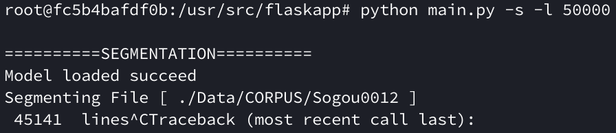

# IR检索系统实验报告

计76  成镇宇  2017080068	

# 实验环境

使用了在dockerhub上的`rn123/pylucene`Image


# 实验过程

# <span id="1">1 分词标注</span>

## 1-1 分词实现

分词用到的第三方库为thulac，先是用的python版本实现：

在命令行中输入

```python
python main.py --training # 用python的thulac分词所有的语料库并进行索引搭建
python main.py --segmenting --limit 50000 # 用python的thulac分词所有的语料库，每个语料库只提取50000则新闻
```

但python的thulac真的花了好长时间，我的电脑带不动。后来换成了手动操作的c++，但也是非常的慢，就还是用python的了。

## 1-2 代码实现

```python
from config import *
import os
import thulac

'''
	分词模块
'''
class SegProcessor:
  def __init__(self, segmentation_limit=LIMIT, training=False):
    self.training = training
    self.segmentation_limit = segmentation_limit
    self.file_loader()

  def file_loader(self):
    lac = thulac.thulac()
    with open(SEGMENTATION_FILE, 'w') as outfile:
      for file_name in os.listdir(CORPUS_DIR):
        if file_name == ".DS_Store":
          continue
        with open(CORPUS_DIR + file_name, "r") as f:
          print("Segmenting File [", CORPUS_DIR+file_name, "]")

          # 语料库是Sogou的情况下
          if "Sogou" in file_name:
            line_count = 0
            line = f.readline()
            while (line):
              terms = line.split(" ")
              for i in range(len(terms)):
                if terms[i] == '<N>':
                  terms[i] = '0'
              
              s = ""
              combined = s.join(terms) # merged a sentence
              segmented = lac.cut(combined, text=True) # segmentation process
              outfile.write("{}\n".format(segmented))

              # print(segmented)
              print("\r", str(line_count), " lines", end="", flush=True)
              line_count = line_count + 1
              if line_count > self.segmentation_limit and not self.training:
                f.close()
                break
              line = f.readline()
          
          # 语料库不是Sogou的情况下
          else:
            line = f.readline()
            line_count = 0
            while (line):
              segmented = lac.cut(line, text=True) # segmentation process
              outfile.write("{}\n".format(segmented))

              # print(segmented)
              print("\r", str(line_count), " lines", end="", flush=True)
              line_count = line_count + 1
              if line_count > self.segmentation_limit and not self.training:
                f.close()
                break
              line = f.readline()
          print()
```

## 1-3 语料库


## 1-3 分词结果




Sogou0012 录入了45141则新闻

rmrb、Sogou0010、0011、0013、0014分别录入了10000则新闻。

全部都存在了`./Data/SEGMENTATION.txt`中.


# <span id="1">2 索引建立</span>

## 2-1 索引建立实现

该部分用于建立所有的文章的索引，对于语料库的每一个article当做一个Document。

建立索引用的Analyzer是whitespaceanalyzer，因为已经用thulac分析了词性分好词了，只需要根据空格实现即可。

之前的实现是直接把thulac生成的分词结果直接塞到lucene里面进行检索，但queryparse无法对`_`进行分析，所以就分成了两个来存储，一个field是文章内容，还有一个是词性。其中文章内容（context）的 fieldtype，需要搭建索引、存储、向量化；词性的（phrase）fieldtype，只需要存储。

## 2-2 代码实现

```python
import os
import lucene
from config import *
from pathlib import Path

from java.nio.file import Paths
from org.apache.lucene.store import SimpleFSDirectory
from org.apache.lucene.analysis.core import WhitespaceAnalyzer
from org.apache.lucene.util import Version
from org.apache.lucene.index import IndexWriter, IndexWriterConfig, IndexOptions
from org.apache.lucene.document import Document, Field, FieldType, StringField

'''
	索引搭建模块
'''
class Indexer:
  def __init__(self, path=INDEX_DIR, index_limit=LIMIT, training=False):
    self.index_limit = index_limit
    self.training = training
    
    p = Path(path)
    if not p.is_dir():
      os.mkdir(path)
    
    # 初始化lucene，准备好analyzer和writer
    lucene.initVM()
    indexdir = SimpleFSDirectory(Paths.get(path))
    analyzer = WhitespaceAnalyzer(Version.LATEST) # 由于thulac分词的时候已经实现了用空格来表示不同的词，所以直接用空格分析器就可以。
    iwconf = IndexWriterConfig(analyzer)
    iwconf.setOpenMode(IndexWriterConfig.OpenMode.CREATE_OR_APPEND)
    index_writer = IndexWriter(indexdir, iwconf)

    self.Indexing(index_writer)
  
  def Indexing(self, writer):
    print("Indexing Segmented File [", SEGMENTATION_FILE, "]")
    with open(SEGMENTATION_FILE, 'r') as f:
      line_count = 0
      for line in f:
        # 建立 context 的 fieldtype，需要搭建索引、存储、向量化
        fieldtype_context = FieldType()
        fieldtype_context.setIndexOptions(IndexOptions.DOCS_AND_FREQS)
        fieldtype_context.setStored(True)
        fieldtype_context.setTokenized(True)

        # 建立 phrase 的 fieldtype，只需要保存
        fieldtype_phrase = FieldType()
        fieldtype_phrase.setStored(True)

        # 对分词好的内容进行处理，把词语和词性分开来存储
        processed_context, processed_phrase = self.process_line(line)

        doc = Document()
        # context field是用于记录文章的内容
        doc.add(Field('context', processed_context, fieldtype_context))
        # phrase field适用于记录文章每个词所对应的词性
        doc.add(Field('phrase', processed_phrase, fieldtype_phrase))

        # 把document写入索引库
        writer.addDocument(doc)

        # 跟踪程序运行情况用
        print("\r", str(line_count), " lines", end="", flush=True)
        line_count = line_count + 1
        if line_count > self.index_limit and not self.training:
          break

    writer.close()
    print()

  # 对分词好的内容进行处理，把词语和词性分开来存储
  def process_line(self, line):
    processed_context = []
    processed_phrase = []
    terms = line.split(' ')
    for index, term in enumerate(terms):
      splitted = term.split('_')
      if len(splitted) > 1:
        processed_context.append(splitted[0])
        processed_phrase.append(splitted[1])

    return ' '.join(processed_context), ' '.join(processed_phrase)
```

## 2-3 搭建索引结果


搭建了`95146`行的索引。


# <span id="3">3 信息检索</span>

## 3-1 检索

### 核心思路 - 步骤

1. 进行query的预处理，假如query中带有用户输入的词性，则跳到2-2，否则进行2-1.
2. 根据query进行检索（选用`SmartChineseAnalyzer`进行中文内容的检索）
   1. 用户输入无词性的情况下：
      1. 直接用query进行检索
      2. 有了最后的检索结果后进行第三步
   2. 用户输入有词性的情况下：
      1. 把query中的词性提取出来
      2. 用没有包含词性的query进行检索
      3. 检索出来的结果进行词性对比，假如所对应的词语的词性一致，就添加到检索结果中，否则不添加
      4. 有了最后的检索结果后进行第三步
3. 把检索结果进行拼接（因为是分词存好的）
   1. 拼接的时候主要是判断有没有重复的搜索结果以及位置拘束的处理
      1. 去重：就是判断是否在list中，来判断添不添加
      2. 位置拘束：以用户搜索的词为中心，进行左右的扩散，假如遇到stopwords（标点符号）就停下来。
   2. 返回给flask前端

### 测试方式 - 在README中复制粘贴过来的

在浏览器上前往`localhost:5000/`

#### **每次搜索的时候搜索框里一定得有东西！**

1. **无位置约束：**

   1. word word 搜索：直接输入即可

      ```
      中国 强大
      ```

   2. word/phrase word/phrase搜索：`词语/词性`

      ```
      中国/n 强大/a
      ```

2. **有位置约束：**

   1. word word 搜索 + 位置约束：直接输入即可，在`restriction`输入2-5之间的数值

      ```
      中国 强大 
      2
      ```

   2. word/phrase word/phrase搜索 + 位置约束：`词语/词性`，在`restriction`输入2-5之间的数值

      ```
      中国/n 强大/a
      2
      ```

3. **前四种的混合：**

   即搜索词中，有的词可以有phrase也可以没有，位置约束也是可加可以不加。比如

   ```
   中国/n 强大
   2
   ```

## 3-2 代码实现

```python
import lucene
from config import *
from java.nio.file import Paths
from org.apache.lucene.index import DirectoryReader
from org.apache.lucene.store import SimpleFSDirectory
from org.apache.lucene.analysis.cn.smart import SmartChineseAnalyzer
from org.apache.lucene.queryparser.classic import QueryParser
from org.apache.lucene.search import IndexSearcher
from org.apache.lucene.util import Version
from org.apache.lucene.search.highlight import Highlighter, QueryScorer, SimpleHTMLFormatter

# 为了在判断位置约束的时候用，加载stopwords
with open('stopwords.txt', 'r') as f:
  global punctuation
  punctuation = []
  for p in f:
    punctuation.append(p.strip('\n'))

class Retriever:
  def __init__(self, path=INDEX_DIR):
    # 初始化lucene，设置好analyzer、reader、searcher和分词器
    lucene.initVM()
    self.indir = SimpleFSDirectory(Paths.get(path))
    self.analyzer = SmartChineseAnalyzer()
    self.reader = DirectoryReader.open(self.indir)
    self.searcher= IndexSearcher(self.reader)
  
  # pylucene库自己本身有问题，没有办法自己控制线程，需要每次自己手动attach一个防止线程出错
  def attachCurrentThread(self):
    vm_env = lucene.getVMEnv()
    vm_env.attachCurrentThread()
    return vm_env

  # 当用户搜索的query中带有词性时
  def search_phrases(self, query_str):
    print(".....search_phrases")
    # 用来存储用户的输入的词语
    queries = []
    # 用来存储用户的输入的词性
    query_phrases = []
    # 提取用户输入的搜索词
    query_terms = query_str.split()
    for term in query_terms:

      # 假如用户输入的词中有词性
      if '/' in term:
        cutted_term = term.split('/')
        queries.append(cutted_term[0])
        query_phrases.append(cutted_term[1])

      # 假如用户输入的词中没有词性，则默认给''
      else:
        queries.append(term)
        query_phrases.append('')
    
    parsed_query = QueryParser("context", self.analyzer).parse(' '.join(queries))
    # 信息检索
    total_hits = self.searcher.search(parsed_query, MAX)
    result_contexts = []
    for hit in total_hits.scoreDocs:
      doc = self.searcher.doc(hit.doc)
      terms = (doc.get("context")).split(" ")
      phrases = (doc.get("phrase")).split(" ")
      # 用于判断搜索到的内容的query字段的词性是否与用户所期望的词性相符
      flag = True
      
      for index, term in enumerate(terms):
        if term in queries:
          i = queries.index(term)
          # 对比检索到的词语的词性是否和用户输入的词性一致，不一致就不添加该document到返回结果中
          if query_phrases[i] != phrases[index] and query_phrases[i] != '':
            flag = False
            break
      if flag:
        result_contexts.append([' '.join(terms), hit.score])
    
    return result_contexts, parsed_query

  # 当用户搜索的query中没有词性时
  def search_terms(self, parsed_query):
    print(".....search_terms")
    # 信息检索
    total_hits = self.searcher.search(parsed_query, MAX)
    result_contexts = []
    for hit in total_hits.scoreDocs:
      doc = self.searcher.doc(hit.doc)
      context = doc.get('context')
      result_contexts.append([context, hit.score])
    
    return result_contexts

  # 从flask对接过来的接口，
  def search(self, query_str, restriction=2):
    self.attachCurrentThread()

    # 对query进行解析
    parsed_query = QueryParser("context", self.analyzer).parse(query_str)
    result_contexts = []
    # 根据有没有‘/’判断有没有词性，
    if '/' in query_str:
      # 有词性就转到search_phrases
      result_contexts, parsed_query = self.search_phrases(query_str)
    else:
      # 有词性就转到search_terms
      result_contexts = self.search_terms(parsed_query)
    
    # 将搜索结果复原为文章返回
    self.recover_to_article(query_str, result_contexts, restriction)
    
    final_result = []
    #进行搜索结果中跟query相关的文段高量处理
    simpleHTMLFormatter = SimpleHTMLFormatter(u"<b><font color='red'>", u"</font></b>")
    for index, recovered_query in enumerate(self.recovered_queries):
      # 不是直接拿用户输入的query来进行高亮处理，而是通过我们自己处理好的包含了位置约束的query进行高亮处理
      highlighter = Highlighter(simpleHTMLFormatter, QueryScorer(QueryParser("context", self.analyzer).parse(recovered_query)))
      highLightText = highlighter.getBestFragment(self.analyzer, 'context', self.recovered_contexts[index])
      if highLightText is not None:
        final_result.append(highLightText)
    
    return final_result

  # 将搜索结果复原为文章返回
  def recover_to_article(self, query_str, contexts, restriction):
    self.recovered_queries = []
    self.recovered_contexts = []

    for context in contexts:
      # context中第一个元素是还未处理的文章内容，第二个元素是score
      terms = context[0].split(' ')
      score = context[1]
      length = len(terms)
      for matched_index, term in enumerate(terms):
        # 假如该词在用户输入的搜索query中
        if term in query_str:
          joined = ''.join(terms)
          # 确保没有重复的结果，跟set效果一致
          if joined not in self.recovered_contexts:
            # 位置约束处理
            tmp_matched_query = self.get_restriction_query(terms, length, matched_index, restriction)
            # 添加位置约束处理过后的query
            self.recovered_queries.append(tmp_matched_query)
            # 添加检索到的文段内容
            self.recovered_contexts.append(joined)
          # 多检索词语的情况下
          else:
            index = self.recovered_contexts.index(joined)
            # 位置约束处理
            tmp_matched_query = self.get_restriction_query(terms, length, matched_index, restriction)
            # 添加位置约束处理过后的query
            self.recovered_queries[index] += tmp_matched_query
  
  # 位置拘束
  def get_restriction_query(self, terms, term_length, matched_index, restriction):
    # 以检索到的词语为中心
    sentence = terms[matched_index]
    # 计算左边的边界
    tmp = matched_index - restriction
    left_boundary = tmp if tmp >= 0 else 0
		# 计算右边的边界
    tmp = matched_index + restriction
    right_boundary = tmp if tmp < term_length else (term_length - 1)
    # 左右两边的iterator
    l = matched_index - 1
    r = matched_index + 1
    # 添加在位置约束范围内的内容
    while left_boundary < l and r < right_boundary:
      # 假如左边不是stopwords，则添加
      if terms[l] not in punctuation:
        temp = terms[l]
        temp += sentence
        sentence = temp
        l -= 1
      # 假如右边不是stopwords，则添加
      if terms[r] not in punctuation:
        sentence += terms[r]
        r += 1
      # 假如左右都是stopwords，则退出
      if terms[l] in punctuation and terms[r] in punctuation:
        break
    return sentence

    
```

## 3-3 检索结果

### 3-3-0 home page


### 3-3-1 无位置约束：

1. word word 搜索：直接输入即可

   ```
   输入：
   1. 中国 强大
   2. 世界 中国 第一
   ```

   

   

2. word/phrase word/phrase搜索：`词语/词性`

  ```
  输入：
  1. 中国/ns 强大/a
  2. 世界/ns 中国/ns 第一/a
  ```
  
  
  
   

### 3-3-2 有位置约束：

1. word word 搜索 + 位置约束：直接输入即可，在`restriction`输入2-5之间的数值

   ```
   输入：
   1. 中国 强大 restriction=2
   2. 中国 强大 restriction=5
   ```

   

   

   

2. word/phrase word/phrase搜索 + 位置约束：`词语/词性`，在`restriction`输入2-5之间的数值

   ```
   输入：
   1. 中国/ns 强大/a restriction=2
   2. 中国/ns 强大/a restriction=5
   ```

   


### 3-3-3 前四种的混合：

即搜索词中，有的词可以有phrase也可以没有，位置约束也是可加可以不加。

```
输入：
1. 世界 中国/ns 第一 restriction=5
2. 世界 中国/ns 第一 restriction=2
```


# 4 实验总结

通过本次实验学习了如何用第三方工具（pylucene）建立索引分析返回的结果，了解了倒排文件结构系统以及原理。但个人感觉自己的位置拘束实现不是特别智能，较为粗暴，而且没有进行两个词语一起的时候的位置拘束分析，而是每个词分开进行位置拘束分析。同时lucene的搜索结果在多词的情况下，有的时候会把只包含了一个词的搜索结果列为最高的分值，反而有包含了所有的query词语的搜索结果却分值很低，这个是我暂时没有想到解决方案的。

# 5 实验中遇到的问题

1. 搭建pylucene环境的时候遇到了很多的问题，特别是在java的配置上，由于我的电脑上有java8和java12，所以总是会出问题，花了两天多的时间，后来一个docker image就解决了。
2. pylucene的api文档只能从java版本中找，官方有说是通用的，但用的过程中总是有差异。
3. 之前docker container中生成的分词和index数据放错位置，container删掉之后就也被删掉了，所以最后还得重新生成分词和index数据，而且还是最后交作业的时候，所以只能重新生成然后持交了。。。